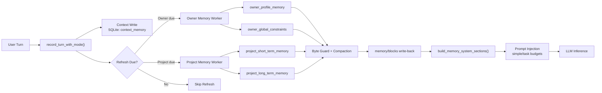
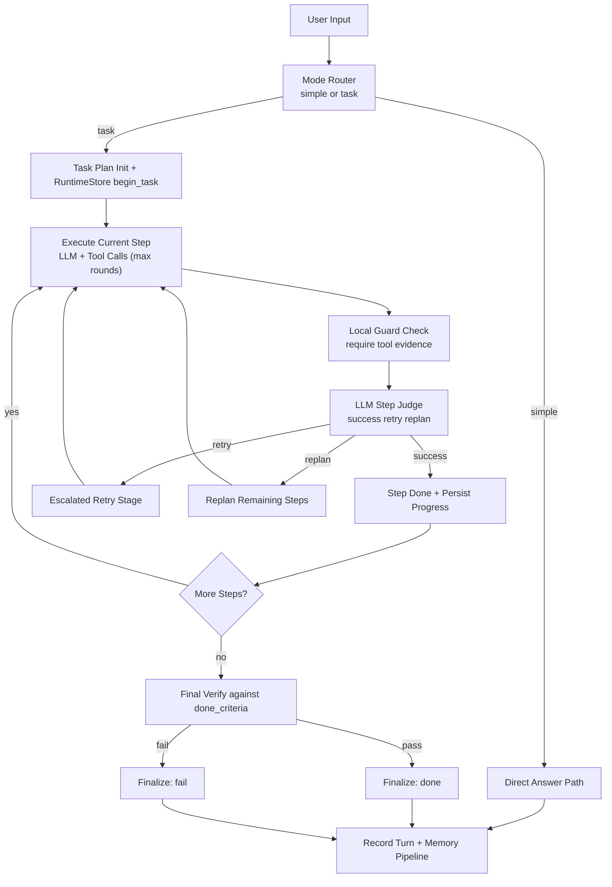

# BadDragon

<p align="center">
  
</p>

<p align="center"><strong>Layer-First Agent Runtime with Memory and Tool-Evidence Guardrails</strong></p>

BadDragon is a lightweight, layer-first agent framework focused on controllability and clean evolution.
It keeps the core loop compact, enforces strict architectural boundaries, and is designed for teams that want to move fast without turning the codebase into a monolith.

## Project Status

This project is actively evolving and still under heavy development.

- APIs, module boundaries, and behavior may change.
- We prioritize correctness, clarity, and maintainability over premature feature expansion.
- Contributions and issue reports are welcome.

## Why BadDragon

- Strict six-layer architecture with explicit dependency direction.
- Dual orchestration modes (`simple` and `task`) for incremental complexity.
- Tool-evidence guardrails to avoid "claimed success without real execution".
- Minimal dependency strategy with OpenAI-compatible model access.
- Local runtime persistence for resumable task execution.

## Memory Engine Blueprint

BadDragon memory is not a single blob. It is a layered memory system with scheduled refresh, compaction limits, and runtime injection.



Operational characteristics:

- Context turns are persisted first, then memory refresh is evaluated.
- Owner memory refresh interval is dynamic (fast when memory is small, slower when it grows).
- Project memory refresh requires enough recent context and runs on fixed cadence.
- Every memory block has hard byte limits with local safety compaction.
- Injected memory is mode-aware (`simple` vs `task`) with different section budgets.

## Quick Start

```bash
python3 -m app.main
```

Quick smoke path:

```bash
python3 -m app.main --hello
```

Run tests:

```bash
python3 -m unittest discover tests
```

## Architecture

BadDragon follows a fixed six-layer design:

1. `app/interfaces`
   Input/output boundaries only (CLI/API/UI entrypoints).
2. `app/orchestrator`
   Task routing, loop control, and state transitions.
3. `app/llm`
   Model requests, responses, and tool-call normalization.
4. `app/tools`
   Tool implementations and registry/dispatch.
5. `app/memory`
   Memory storage, retrieval, and prompt injection.
6. `app/infra`
   Shared config/logging/storage/utilities.

Required dependency direction:

`interfaces -> orchestrator -> (llm/tools/memory) -> infra`

Reverse coupling across layers is not allowed.

## Operation Blueprint

This is the runtime control loop that keeps execution grounded in observable tool evidence.



Execution guardrails:

- Task mode enforces one-step focus with observable evidence before claiming success.
- Web-intent tasks require valid web actions (not just empty scans) to pass local guard.
- No-new-information retries are blocked and forced to replan.
- Runtime state is resumable through `TaskRuntimeStore` with active/last snapshots.

## Repository Layout

- `app/`: core source code
- `assets/brand/`: logo, avatar, and favicon assets
- `data/`: runtime data
- `logs/`: runtime logs
- `tests/`: unit tests
- `config.json`: runtime model/provider settings

## Model Configuration

Edit `config.json`:

- `model.default`
- `model.provider`
- `model.base_url`
- `model.api_key`

Provider resolution lives in `app/llm/runtime_provider.py`.

Current runtime path is OpenAI-compatible `chat.completions`, with SDK-optional fallback behavior.

## Design Principles

- Keep required dependencies minimal.
- Add optional capabilities as optional dependencies.
- Preserve deterministic structure before adding surface features.
- Keep each layer single-purpose and easy to test.

## Roadmap (Early Stage)

- Better external browser/session integration.
- Expanded tool library with stronger safety constraints.
- More robust memory update and retrieval strategies.
- API-facing interface beyond terminal-first usage.
- CI and release hardening for team workflows.

## Contributing

The project is early and changing quickly, so small, focused PRs are preferred.

When contributing:

1. Keep layer boundaries intact.
2. Add or update tests for behavior changes.
3. Avoid cross-layer shortcuts for convenience.
4. Document new modules and config changes.

